# Project made by cg-t01-g07

## Students

- Diana Martins - up202108815
- Marcos Costa - 202108869

## 1. Sky-Sphere

### Creating a Sphere

Create a sphere with a radius of 1.0 and centered at the origin.

### Adding a Texture of the Earth 

Added a texture of the Earth to the sphere.

### Adding a MyPanorama class

Creating a panorama class that uses an inverted sphere to display a 360 degree panorama.

Screenshot of two different panoramas:

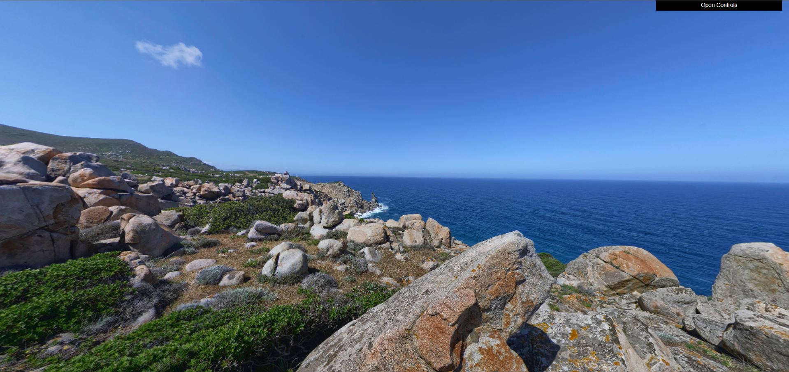

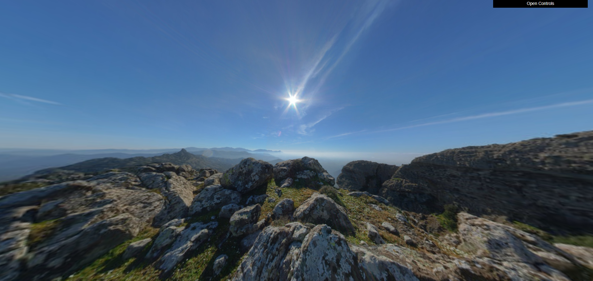

## 2. Flowers

### Modelling a flower

Using as basis the work done in the previous tp classes, we created a basic flower with:
- A pyramid with 12 sides as the receptacle;
- Diamonds as petals;
- A cylinder as the stem.

To these we applied translations and rotations so that they'd look like the given flower model.

### Parameterizing the flower

We enhanced the flower's realism by introducing adjustable parameters in its constructor:
- **topRotAngle** - rotation angle of the top of the flower, to simulate the flower tilting towards the sun;
- **externalRadius** - the radius around the petals, adjustable from 3 to 7;
- **petalsNum** - total number of petals of the flower;
- **petalsColor** - color of the flower's petals;
- **petalsRotAngles** - rotation angle of each petal, to make them appear curved;
- **petalsUnionAngles** - union angle of each petal, so that they tilt upwards;
- **petalsTexture** - texture of the petals;
- **petalsTexCoords** - texture coordinates of the petals (corresponding to the given texture);
- **receptacleRadius** - radius of the receptacle;
- **receptacleColor** - color of the receptacle;
- **receptacleTexture** - texture of the receptacle;
- **receptacleTexCenter** - center of the circular texture of the receptacle (corresponding to the given texture);
- **receptacleTexRadius** - radius of the circular texture of the receptacle (corresponding to the given texture);
- **stemRadius** - radius of each stem;
- **stemColor** - color of the stem;
- **stemSize** - number of stems on a flower;
- **stemTexture** - texture of the stem;
- **leavesTexture** - texture of the leaves;
- **leavesTexCoords** - texture coordinates of the flower leaves (corresponding to the given texture);

In this step, we added a second layer of petals, defined the length of the stem, and included leaves with their own stems. We also improved all the previously created elements of the model.

The main challenges were designing the petals and the stem. It was particularly difficult to find the right formulas for the curvature of the petals and to accurately calculate the bend of the stem while positioning the leaf stems correctly.

These improvements have made our flower model look much more realistic.

### Randomness and diversity in the flower

We used JavaScript's random function to introduce variability in numerous aspects of the flower model, enhancing its natural appearance. Namely, we randomized:
- **All of the Angles**: we varied the rotation angle of the top of the flower, the union and junction angles of the petals and leaves, the angles connecting petals to the receptacle, the curvature of the stem, and the inclination of the leaf stems;
- **All of the Sizes**: we randomized the number of stems per flower, the length of each stem and leaf stem, the radius of stems, leaf stems, and the receptacle, as well as the sizes of the petals, leaves, and the flower's external radius;
- **Colors**: each part of the flower could takes on any color from a predefined array;
- **Textures**: three different petal textures and two receptacle textures are randomly applied to each flower;
- **Leaf Stems' Position and Petal Number**: we also randomized the positioning of leaf stems along the main stem, with some pointing to the right and others to the left, and varied the number of petals per flower.

Additionally, we created a MyGarden class that arranges flowers in a grid of size m*n, which can be adjusted in the interface. We used a random distribution to place flowers within this matrix, enhancing the realism of the garden layout.

### Textures on the flowers

We applied textures to all parts of the flower to make them look more realistic and varied, which helps the garden scene look more vibrant and diverse.

This allowed us to create a garden that not only looks better but also feels more natural due to the variability in the appearance of its flowers.

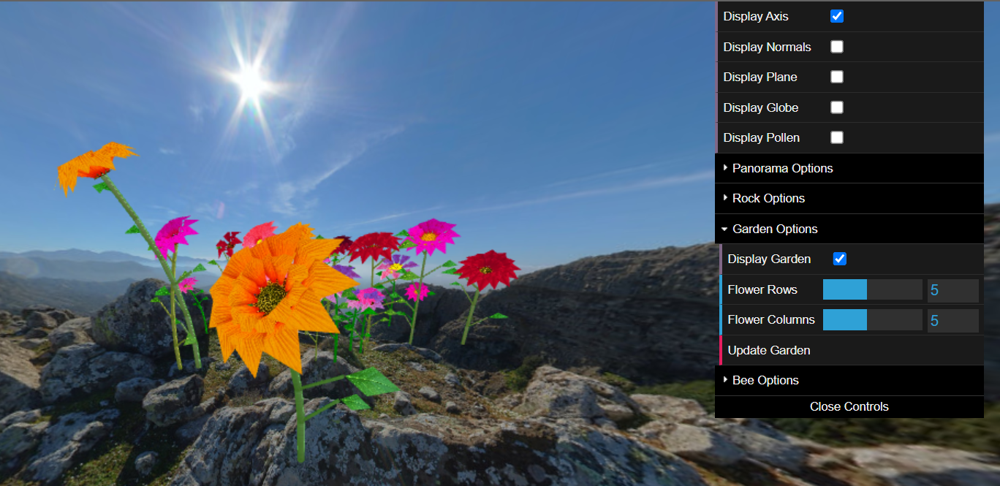

## 3. Rocks and boulders

### Creating a Rock

We used the sphere class to create a rock by moving the vertices in the direction of the normal vector a random amount, thus creating protrusions and recesses. We also altered slightly the orientation of the normals and added a texture to the rock.

The result is the following:

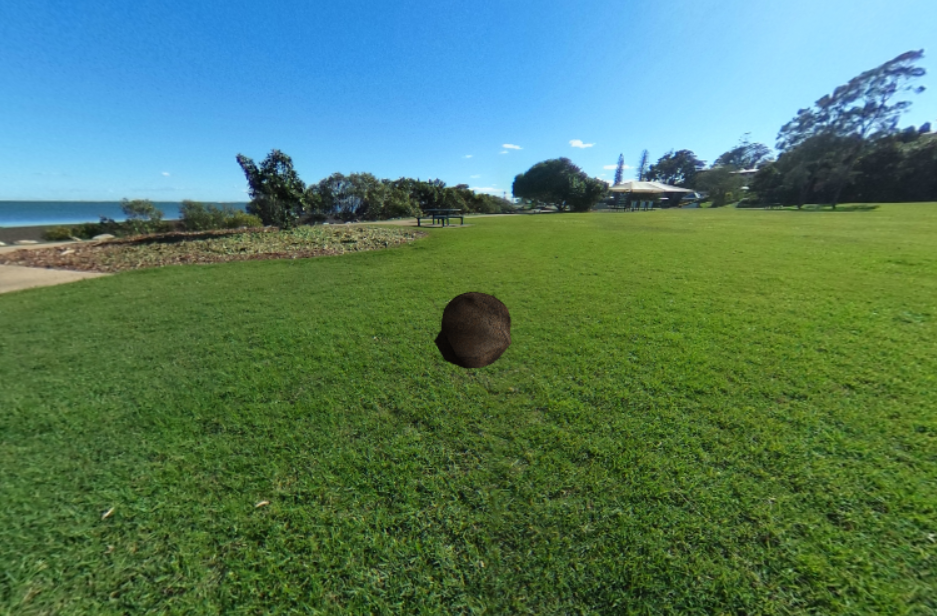

### Creating a Rock Set

Going further, we created a rock set by creating rocks on different layers (that differ in the y-axis) and with different orientations and scales.

End result:

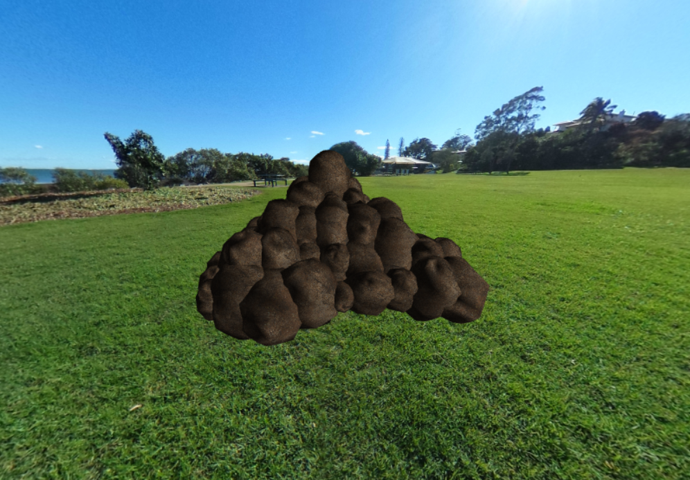

### Creating a Rock Layout

Finally, we created a rock layout which creates instances of the two previous classes and positions them randomly in a given area.

End result:
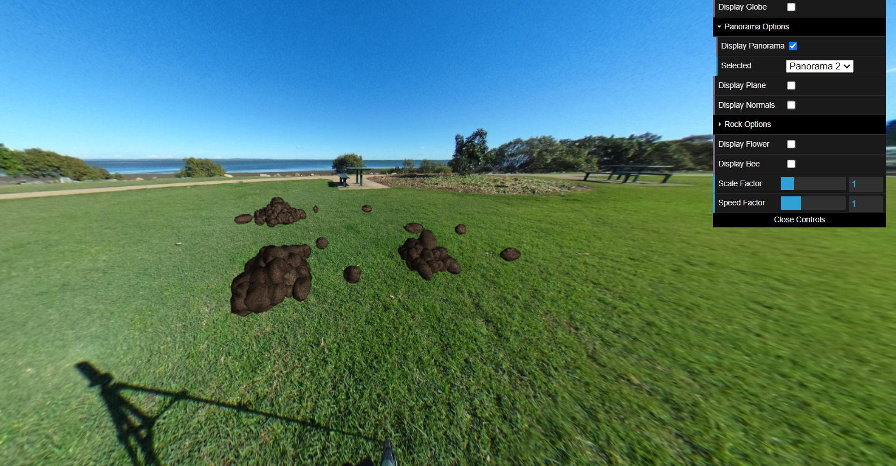

## 4. Bee

### Modeling the bee

We created the model of a bee. The bee is composed of:

- a thorax: a scaled sphere (ellipsoid)
- an abdomen: a sphere
- a head: a scaled sphere (ellipsoid)
- two pairs of wings: we decided against using already existing shapes and instead created the wings from scratch by defining the vertices, normals,indices and texture coordinates.
- six legs: formed solely by spheres. Each leg contains 5 spheres, 3 form the leg while 2 are 'joints' that link the parts of the leg. The former are all scaled spheres, while the latter are spheres with a smaller radius.
- antennas: each antenna is composed of two cylinders, one on top of the other, and a sphere at the end.
- eyes: two scaled spheres (ellipsoids) that are placed on the head.

To obtain the textures for each part of the bee, we had to apply photoshop to images found online so they would work with our model.

We used 5 textures (images) in total for the different parts of the bee: thorax, abdomen, head (including antennas), wings and legs. For the eyes we used a simple material with dark color and white specular reflection.

The final result is:

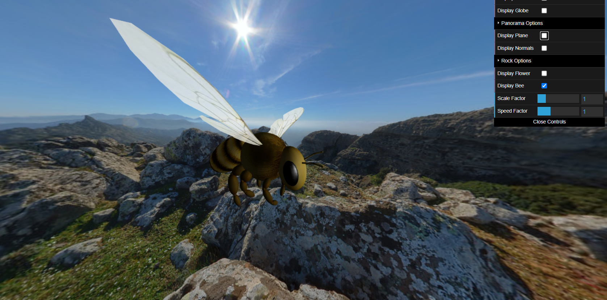

### Animating the bee

We added oscillation to the bee's height and wings to simulate flight. The bee's wings flap up and down, and the bee moves up and down in a sinusoidal motion.

### Controlling the bee

We added keyboard controls to the bee so that it can move in the x and z directions. The user can press 'w' to accelerate the bee forward, 's' to decelerate, 'a' to turn left, and 'd' to turn right.

We also added two sliders to the interface to control the bee's accelaeration and the size of the bee's body.

The result is a bee that can move around the garden and flap its wings as it flies.

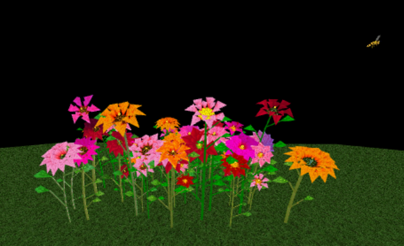

## 5. Pollen and hives

### Creating the objects

We created a MyPollen class - an elongated sphere with a realistic texture. A pollen grain was scaled and randomly rotated before being placed at the tip of each flower receptacle.

Next, we developed a MyHive class, drawing inspiration from a Google image. We recreated the hive using multiple parallelepipeds, applying various transformations and textures to achieve the desired look.

Finally, we added a larger pile of stones next to the garden to serve as the base for the hive.

### Add pollen picking and dropping functionality to MyBee

We added the ability to pick up pollen and send it to the hive. When the user presses the 'f' key, the bee will start descendind and stop if it reaches a flowers receptacle or the floor. The user can press '
'p' to ascend instead. If the user presses 'p' when the bee is on top of a flower, the bee will pick up the pollen and start ascending.

This was the result:

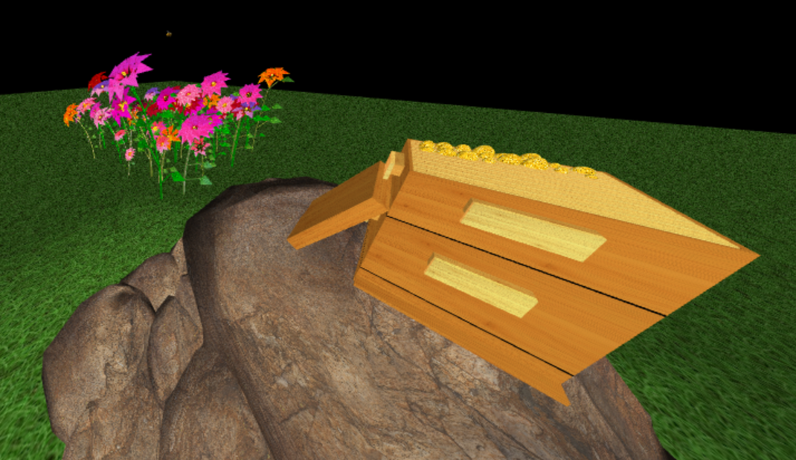

## 6. Grass - Shaders and animation

### Shaping the grass

We started by creating a single grass blade, consisting of three parallelograms and a triangle to form a triangular ribbon. Each leaf was given a random incline to simulate natural bending, and a random rotation around the y-axis to make them face different directions.

Next, we generated a 50x50 grid filled with grass, randomly placing five leaves in each 1x1 unit square, so as to make sure the whole space if filled. Each blade was randomly scaled to vary their sizes. 

As a result, we got a grass field where each leaf has a unique size, bend and orientation, adding to the natural look.

### Waving the grass

The biggest challenge was creating a realistic wind effect using vertex shaders. We implemented a formula to animate the vertices, simulating the motion of grass in the wind. 

Additionally, the fragment shader was used to create a gradient effect, making the grass darker at the base and lighter at the tips to mimic sunlight.

This was the final result:
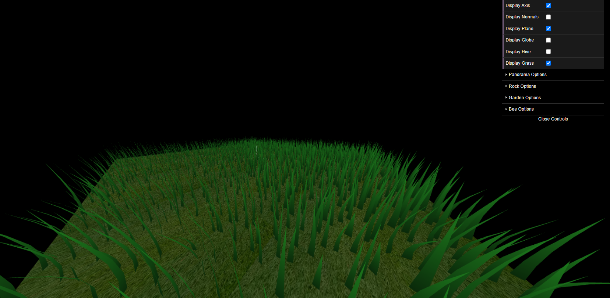

## 7. Additional developments

We picked the option to make the movement of the bee parabolic, so that it moves in a parabolic trajectory instead of a straight line. This was achieved by changing the amount of distance the bee moves in the x and z directions based on its height.

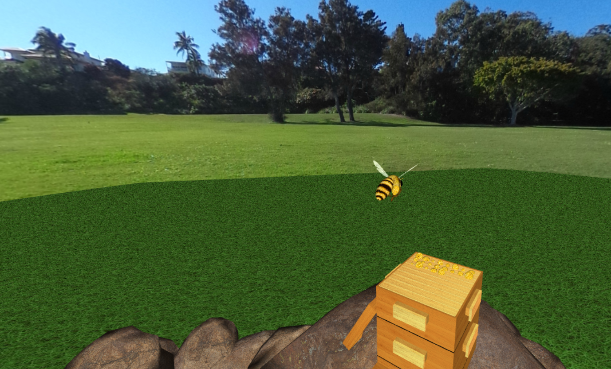