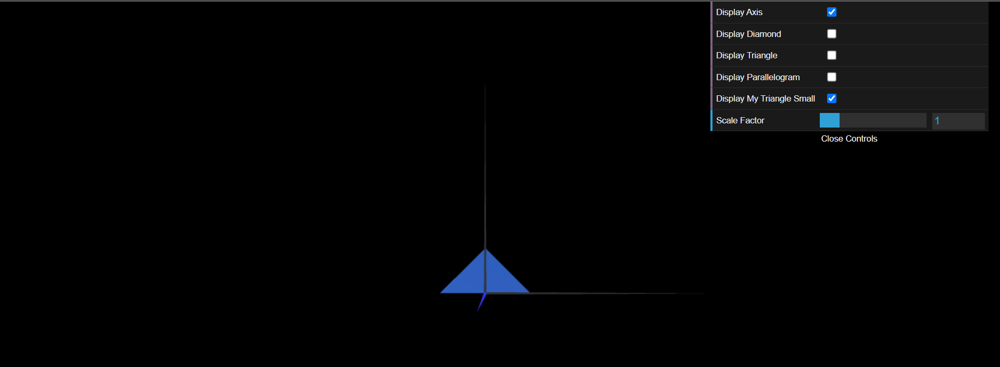
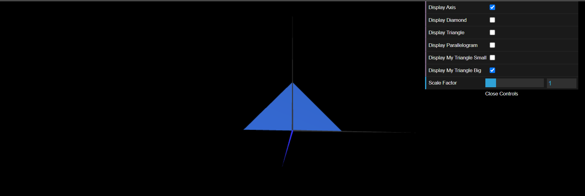

# CG 2023/2024

## Group T01G07

## TP 1 Notes

- In exercise 1, the biggest difficulty was the manipulation of indices to achieve double-sided rendering for the parallelogram. Additionally, creating the MyParallelogram subclass introduced a new level of complexity as it involved synthesizing two triangles to form the parallelogram shape.
- Upon completing exercise 1, exercise 2 proved similar, rendering it simpler to accomplish.

### Diamond

### My Triangle Small

### My Triangle Big

