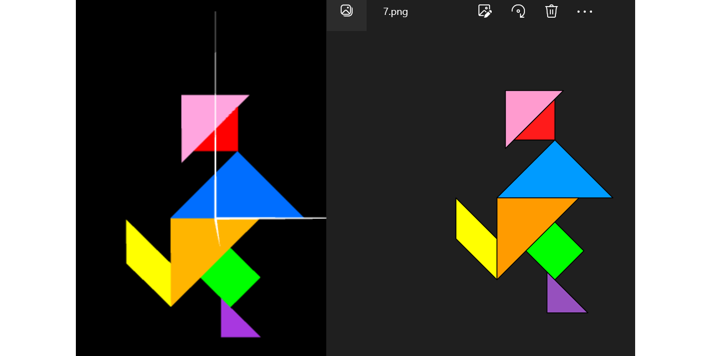
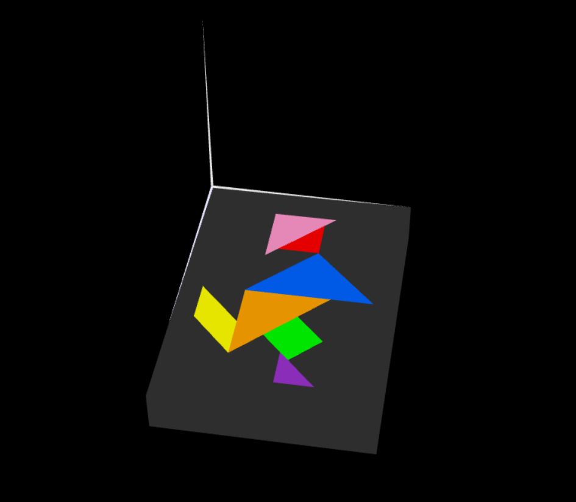
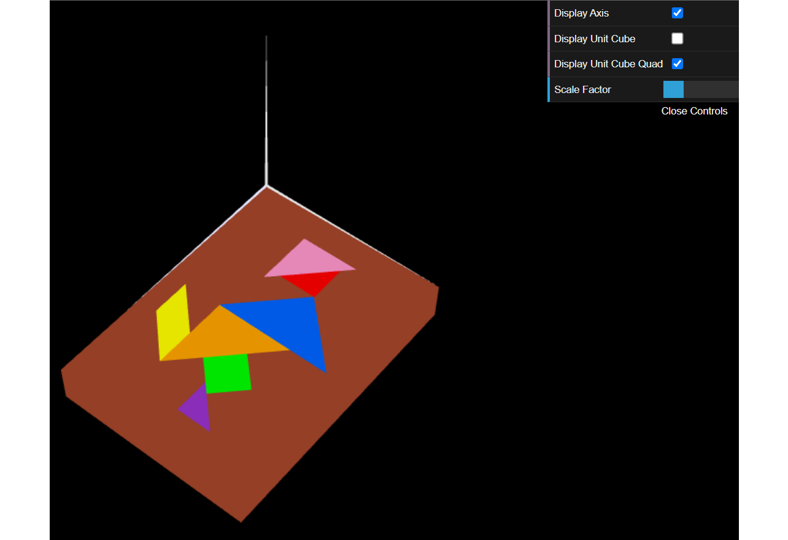

# CG 2023/2024

## Group T01G07

## TP 2 Notes

- In exercise 1, the primary challenge we encountered revolved around effectively applying the required transformations to the objects. Specifically, we faced difficulties with the rotation of the parallelogram and the flips of the pink and red triangles. Despite these hurdles, by consulting the provided slides, we overcame these problems and completed the exercise as intended.
- In Exercise 2, we faced challenges related to lighting and object shading, alongside managing the order of transformations and correctly applying them due to the intricacies of working with 3D models.
- Exercise 3, while somewhat simplified by the completion of the preceding exercises, still proved challenging due to the specific transformations that had to be applied to MyQuad in order to create the cube faces.

### Exercise 1 - MyTangram

### Exercise 2 - Geometria tridimensional - Cubo Unitário 

### Exercise 3 - Geometria composta - Cubo composto por planos

