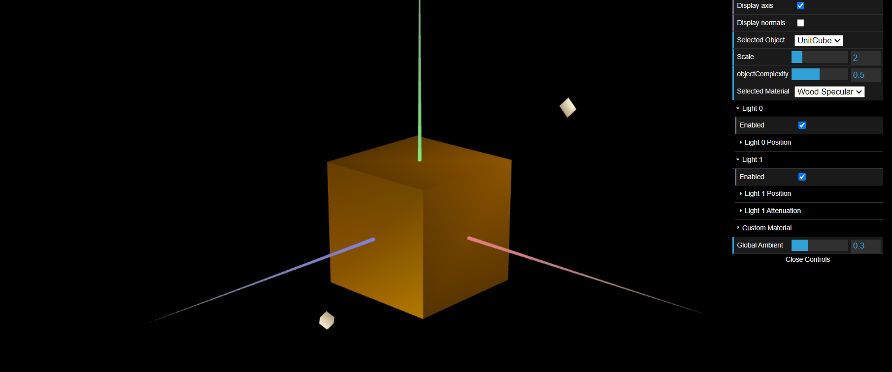
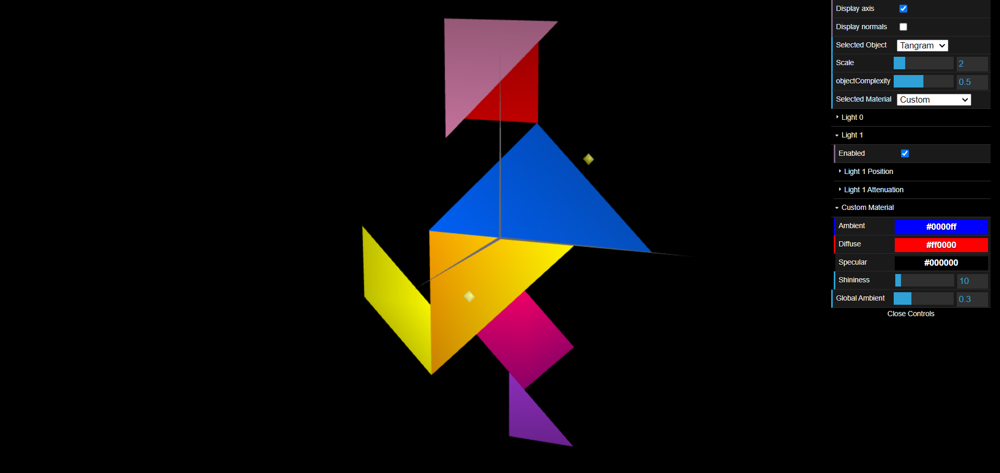
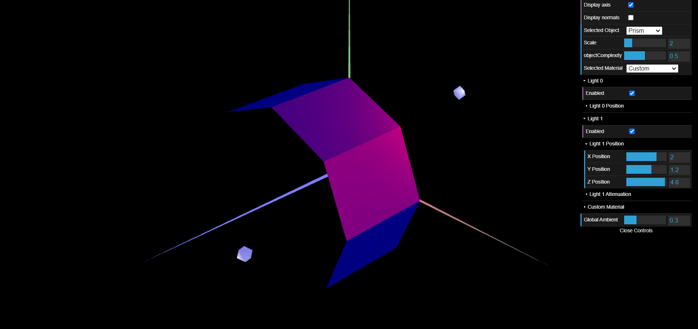
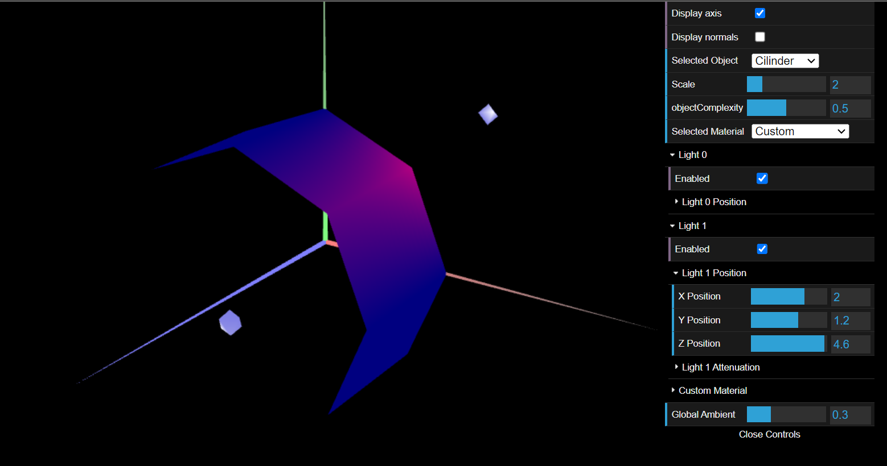

# CG 2023/2024

## Group T01G07

## TP 3 Notes

- In exercise 1, we had to integrate the objects made in TP2 (Tangram and Unit Cube) in the new scene, as well as change them (added vertices and consequently changed the indices) so we could add normals to the vertices. We also created a new material with the color of wood and low specular reflection

- Still in exercise 1, we applied materials with high specular reflection to the tangram pieces.

- In Exercise 2, we built a prism with varying slides and stacks. The major challenge was how to create the vertices, indices and normals for the different slides and stacks. The calculated illumination was similar to the one calculated with Constant Shading, since the normals are the same for all the vertices of the same slide.

- In Exercise 3, using as starting point the prism built in the second exercise, we created a cilinder. The biggest challenge was adjusting the normals' positions to now be perpendicular to the cilinder surface.

#### What we learned:
- The transition from "MyPrism" to "MyCilinder" introduced notable changes in the geometry and shading of the rendered object. 
- In "MyPrism", the vertices are duplicated for each stack, leading to sharp edges along the sides of the prism. However, in "MyCilinder", vertices are only duplicated along the circumference, resulting in a single set of vertices for each edge of the cylinder. This alteration, along with the corresponding adjustment in normals calculation, yields a smoother appearance to the edges, as they now exhibit a curved rather than angular profile. 
- Additionally, the normals in "MyCilinder" are computed to be perpendicular to the curved surface, contributing to the overall smooth shading of the cylinder, in contrast to the flat shading seen in "MyPrism".

### Part 1 - Illumination and Materials of the Tangram

### Part 2 - Drawing of a Prism

### Part 3 - Cylindrical Surface - Gouraud Shading Application

