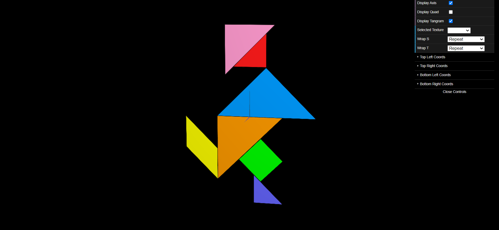
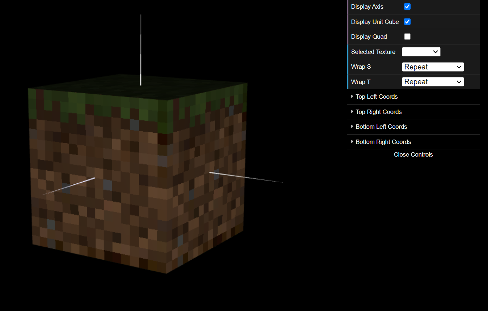

# CG 2023/2024

## Group T01G07

## TP 4 Notes

- In exercise 1, we learn how to use textures and make use of a single file (tangram.png) to texture multiple objects that compose the tangram by using different texture coordinates for each object.

- Completing Exercise 2 was a nice change from the usual tasks, adding some fun and interest to the weekly work. The process of incorporating textures into the unit cube was particularly enjoyable, offering a tangible visual enhancement to the model. 
- Learning about the nuances of texture filtering, specifically the comparison between nearest neighbor and linear filtering, was enlightening. We discovered that while nearest neighbor filtering delivers a sharp yet pixelated aesthetic, linear filtering produces smoother results. 

### Part 1 - MyTangram 

### Part 2 - MyUnitCubeQuad

