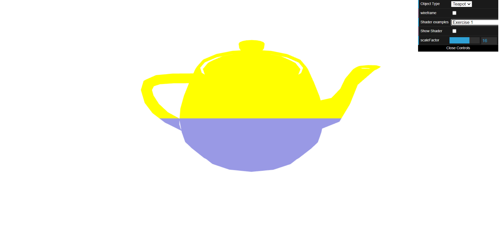
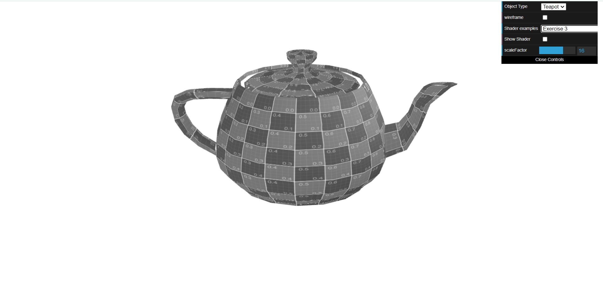
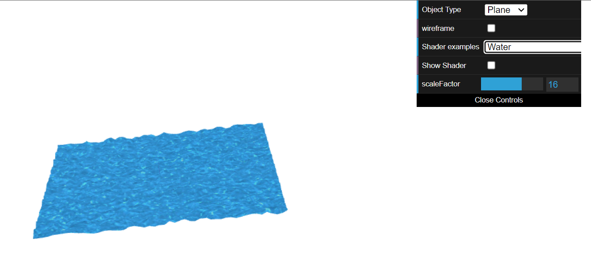

# CG 2023/2024

## Group T01G07

- In exercise 1.1, we are tasked with creating a basic vertex and fragment shader that renders a teapot with two colors (one for each top and bottom half). We learned how to use the `varying` keyword to pass data from the vertex shader to the fragment shader. 

- In exercise 1.2, we are challenged to change the animation provided in the example code to make the teapot oscilate in the x-axis. For that we user the `timeFactor` and `scaleFactor` in the fragment shader to add an offset to the x value of the `aVertexPosition`. We learned how to use the `uniform` keyword to pass data (e.g. `timeFactor`) from the CPU to the GPU.

- In exercise 1.3, we copy and change the sepia shader to create a new shader that greys out the texture of the teapot. We learned how to manipulate the color of the texture in the fragment shader to achieve the desired effect.

- In exercise 2, we transformed a basic plane into a dynamic water surface by incorporating texture and movement. The biggest challenge was creating the "water.vert" file with an offset that resembles water motion effect, given that the rest of the exercise was similar to what was done previously.

## TP 5 Notes

### Picture 1

### Picture 2

### Picture 3

