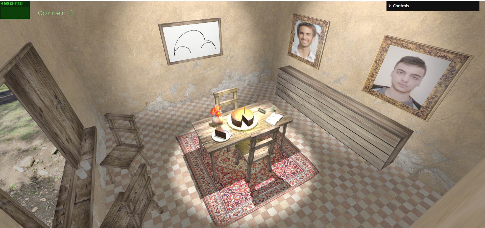

# SGI 2024/2025

## Group T08G03
| Name             | Number    | E-Mail             |
| ---------------- | --------- | ------------------ |
| Rodrigo Moucho         | 202108855 | up202108855@up.pt           |
| Marcos Costa         | 202108869 | up202108869@up.pt  |

----

## Projects

### [TP1 - ThreeJS Basics](tp1)

This project consists of a 3D room scene containing a table with a number of objects surrounded by textured walls, paintings, and a window view. It focuses on learning ThreeJS Basics and includes adjustable cameras, lighting effects, and shadows to emphasize objects. More details can be found in the `tp1` folder's README.
- Scene
  

-----

### [TP2 - ...](tp2)
- (items briefly describing main strong points)

----

### [TP3 - ...](tp3)
- (items briefly describing main strong points)

