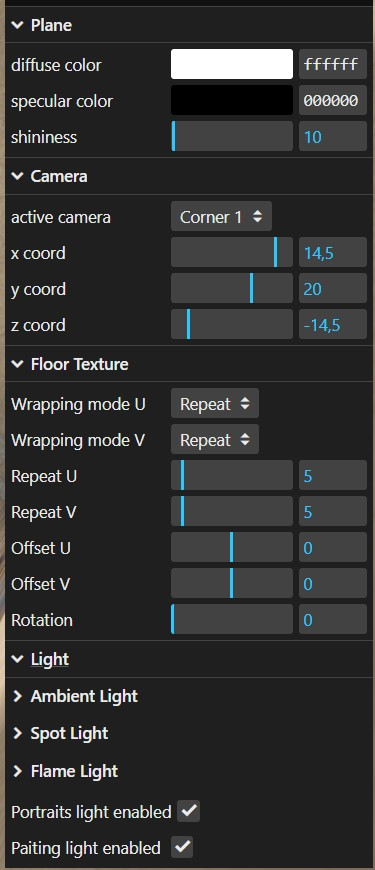
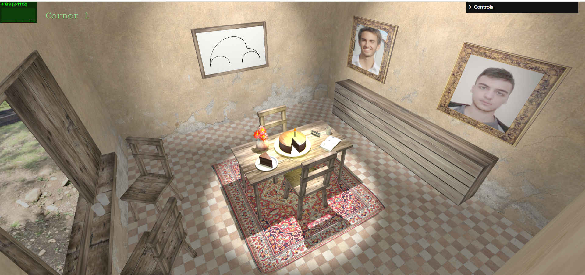

# SGI 2024/2025 - TP1

## Group: T08G03

| Name             | Number    | E-Mail             |
| ---------------- | --------- | ------------------ |
| Marcos Costa      | 202108869 | up202108869@fe.up.pt               |
| Rodrigo Moucho       | 202108855 | up202108855@fe.up.pt                |

----
## Project information

### Project Structure

To avoid large files and unorganized code, we used a modular approach:

- Objects included in the scene are created in separate files inside the objects folder and then imported into MyContents.js, where the scene is composed. 

- Each object takes parameters that allow customization of its class instance, ranging from dimensions to boolean attributes. For example, in the Cake object, the presence of a candle can be specified through an argument in its constructor.

- To prevent identical textures from being loaded more than once, all textures are loaded at the start of MyContents in the loadTextures function and then passed to the objects that require them.

## GUI Controls

### Plane controls

Allows changing the color and shininess of the walls and floor in the scene.

1. diffuse color
2. specular color
3. shininess

### Camera controls 

Includes a variety of predefined camera angles, both perspective and orthographic, allowing visualization from different viewpoints, as well as the ability to adjust the camera position along specific axes.

1. active camera
2. x coord
3. y coord
4. z coord

### Floor Texture controls

Enables experimentation with the floor texture pattern, including options for adjusting wrapping modes, repeats, offsets, and rotation.

1. Wrapping mode U
2. Wrapping mode V
3. Repeat U
4. Repeat V
5. Offset U
6. Offset V
7. Rotation

### Lighting

Allows enabling or disabling each light in the scene, as well as modifying parameters for ambient light, spotlights, and flame light.

1. Ambient Light - ambient color, ambient intensity
2. Spot Light - Enabled, helper, color, intensity, distance, angle, penumbra, decay, castShadow, mapSize, position, target
3. Flame Light - Enabled, castShadow, intensity
4. Portraits light enabled
5. Painting light enabled

## Scene

- Walls and Floor

The walls and floor of the room are constructed using planes with an aged, medieval-style texture. This texture theme is applied consistently throughout the room, creating an immersive atmosphere and reinforcing the desired ambiance.

- Table

The table is composed of four cylindrical legs with a high specular wooden texture and a wooden box for the table top.

- Plates

The plates were constructed using three cylinders to create its base, walls and edge in order to give it a detailed realistic structure

- Cake

The cake was developed by using an incomplete cylinder and two planes to cover the ends of the open section and simulate the inside of the cake. We additionally added the missing slice in a different smaller plate to the scene.

- Candle

The candle on top of the cake was created by simply using a cylinder and the flame using two cones and another cylinder to simulate it's geometry.

- Spring

The spring is constructed using a tube geometry that follows a Catmull-Rom curve, giving it a realistic shape. Caps are added to each end of the spring for a more realistic finish. Aditionally, we use a mettalic and reflective material for the spring to make it look like its made of a metal.

- Newspaper

The newspaper consists of several curved surfaces, NURBS, one for each page. The pages on the right side have degre 1 and 2 in U and V, respectively, and the ones on the left side have degree 1 and 3. The pages in a signle side were created by introducing slight changes to the control points of a reference page, thus obtaining a stack of pages that are slightly different from each other which provides a better asthetic to the final product. Aditionally, we use the image of a newspaper as the texture for the pages.

- Jar

The jar is constructed using two curves that define its left and right sides, which are then joined together to create the desired symmetrical and realistic shape. A base is also created to close the bottom of the jar.

- Flowers

The flower is composed by the stem, a spherical receptacle scaled down in the y axis, and multiple petals arranged around the receptacle to create a natural appearence. The stem, similar to the spring, is created using a curve which then is converted into a tube geometry. The petals are curved surfaces, NURBS. We also added a texture to the stem.

- Chairs
The wooden chairs consist of a seat, a backrest and four legs. The legs are modeled as cylinders and slightly rotated for a more realistic appearence. 

- Beetle Painting

The beetle paiting can be split into 3 objects: the canvas, the curved lines, and the frame. The canvas and the frame are simple geometry. The curved lines that compose the beetle are, as required, Cubic Bezier Curves, that use the ratio presented in the threory slides to create half-circles and quarter-circles using Cubic Bezier Curves. These curves are then placed on the center the canvas and made so the lines protude from the canvas slightly so they dont coincide.

- Portraits

The portraits are made up of a frame that has some thickness to simulate authenticity and a panel with the portrait painting itself

- Window

The window is created by dividing the wall into four different sections, with a central opening formed by a window sill that adds detail and realism to the scene. The landscape features a half-sphere, which simulates depth and perspective, enhancing the overall sense of space.

- Shadows

The spot light highlighting the cake is made to cast shadows. Aditionally, the user has the option to make the light created by the candle flame cast shadows using the GUI interface. 

Several objects are made to cast shadows, namely: the table, the plates, the cake (and everything on it), the window door that is opened, the chairs, the spring, the cups, the carpet, and the newspaper pages.

Similarly, a lot of objects receive shadow in our scene: the walls, the table, the plate, the cake, the floor, the carpet, the chairs, the cups and the newspaper.

- Final scene development

To improve the look of our scene some additional objects were added such as cups, a carpet with nurbs and some wooden furniture.

## Complete Scene

----
## Issues/Problems

The modeling of the vase presented some difficulties, specifically in achieving the envisioned shape and finding an appropriate texture that would fit the theme of the scene.

We also encountered issues with shadows on materials set to DoubleSide, which was fixed by adding a shadow bias to the lights. Additionally, the FPS drops significantly when many lights cast shadows or when the main spotlight’s map size is increased to high values which can create problems in low performance machines.

