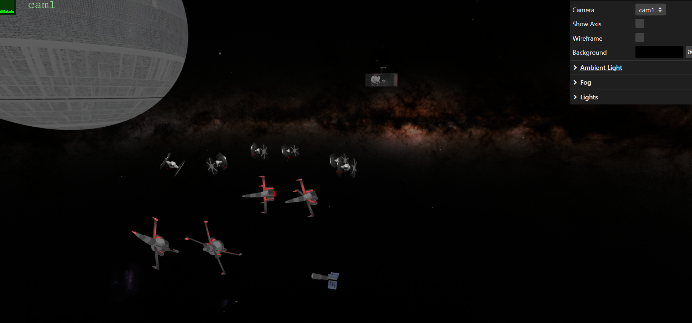
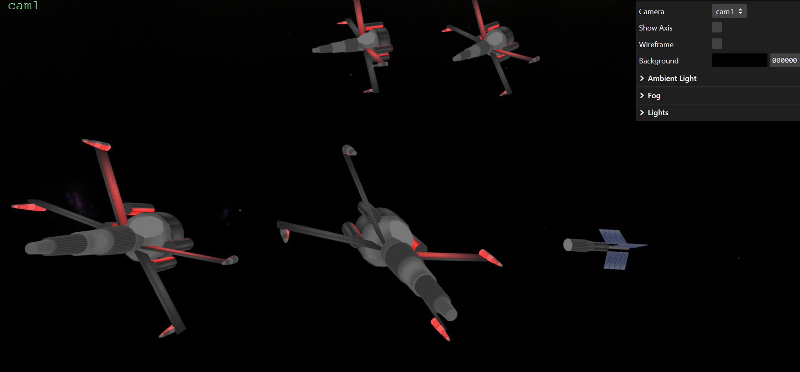
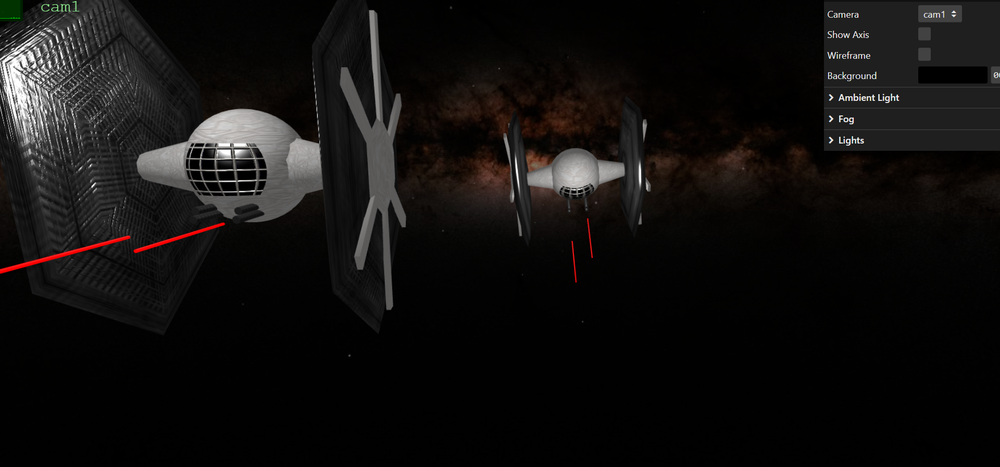
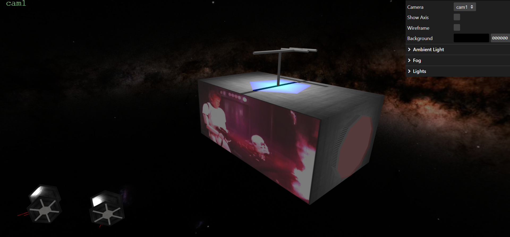
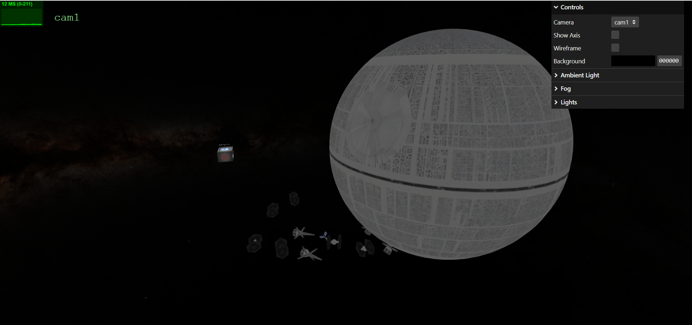
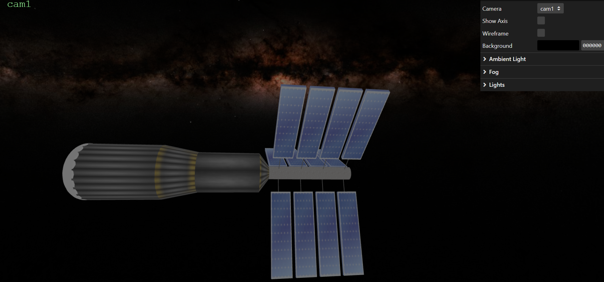
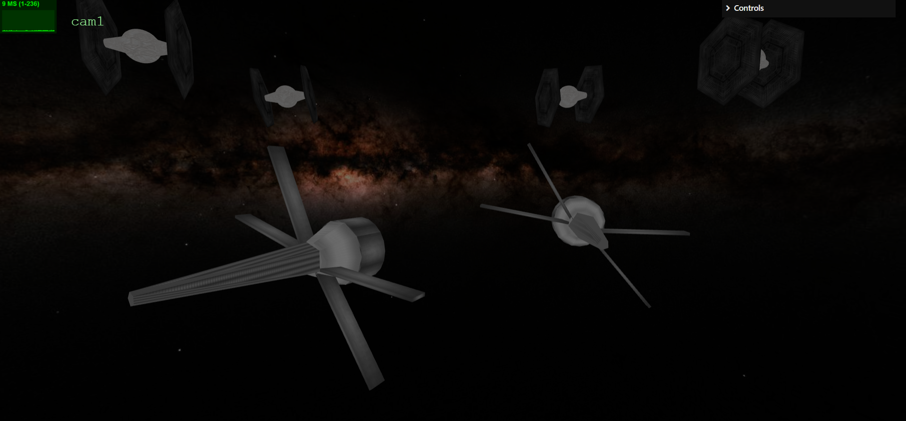
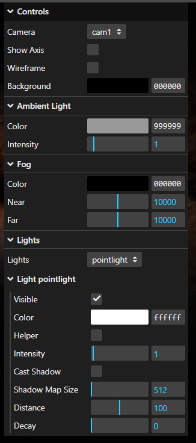

# sgi-tp2-base
The starting point of the second assignment of SGI.

# Our scene

The scene depicts a large space battle with various spaceships inspired by the Star Wars universe. In the background, the Death Star, a massive weapon of destruction, is clearly visible. Amid the battle, a small advertisement ship passes through, playing the trailer for the first Star Wars film ever released as a nod to the series' beginnings and in the distance we can see a small satellite ship.

## X-Fighter Ship

The X-fighter ships, primarily designed with cylindrical shapes and featuring a red light at the rear to simulate engine heat, are depicted fleeing from their pursuers.

## Tie Fighter Ship

Pursuing the X-fighters, the TIE fighters are simpler in design but include key details, such as guns firing red blaster shots. The wings showcase the bump textures specifically developed for our scene.

## Advertisement Ship

The advertisement ship features a video texture displaying the trailer of the first Star Wars movie. It also includes an antenna, whose shadow is projected onto the ship’s surface, where a distinct blue polygon is visible.

## Death Star

The Death Star enhances the scene's setting and serves as a demonstration of mipmap textures, where the texture detail adjusts based on the viewer's distance.

## Satellite Ship

The satellite ship is a simpler design introduced to add variety and depth to the scene.

## LODs

Both the X-fighters and TIE fighters incorporate Levels of Detail (LODs) to optimize performance when viewed from a distance. These ships were selected for LOD implementation due to their frequent appearance in the scene, with six TIE fighters and four X-fighters contributing to the action. This approach ensures a balance between visual fidelity and computational efficiency. In the following image we can see the lower detailed ships up close. 

# Our Code

## Files and classes

Our code is divided into classes/files for modularity and organization. Besides the starting classes (MyContents, etc.), we have a folder named 'parser' with two files 'MySceneData' and 'MyFileReader'. These classes were in the example starting code provided by the teachers, we limited ourselfs to changing them to fit the specification of yasf as well as adding other functions. Other classes we added include:

- MySceneBuilder.js - This class has the objective of creating a THREE.js scene object as well as cameras using the data passed to it in the form of a MySceneData class instance;
- MyLightBuilder.js - This class streamlines the creation of light objects such as PointLight, SpotLight and DirectionalLight.
- MyPrimitiveBuilder.js - This class streamlines the creation of primitive meshes (box, rectangle, nurbs, etc) using the respective primitive data structure.
- MyMaterialBuilder.js - This class aims to create materials from the materials initialized in the MySceneData by cloning them, and then modifying it to fit the primitive that is meant for.

## Program flow

The process of loading the scene and showing it in the screen goes through the following steps:

1. The constructor of MyContents initializes an instance of MyFileReader and passes to it a callback function 'onSceneLoaded' which will be executed once the scene is finished loading and parsing the json file containing the scene.
2. The constructor then calls 'open' from the instance of MyFileReader to begin loading the json file.
3. Once the MyFileReader is finished loading the scene, it will call the callback function provided earlier.
4. The function 'onLoadFinshed' is, like that, called and an argument containing the parse scene data (instance of MySceneData) is passed to it from MyFileReader. This function will then use this scene data to create the scene in THREE.js. 
    - First it consolidates structures like materials and textures so that they are readily available when constructing the scene graph. Additionally, it also runs a few additional checks for errors in the scene data provided. This step is done by calling 'onLoadFinished' from whithin the MySceneData instance.
    - Then, after the materials and textures are fully loaded (asynchronously waiting), it begins the process of constructing the scene by calling 'build' from the class MySceneBuilder, passing it the scene data object obtained from MyFileReader.
5. The MyFileReader builds the scene by recursively traversing the graph and, for each node, creating a THREE.Group. It's noteworthy to note that nodes referenced multiple times are only constructed from scratch once, and any subsequent reference to it is handled by cloning the corresponding group and traversing it to update the attributes that are passed down from the parent node.

The parsing and the constructing of the scene both check for errors in the data of the json file, be it syntax, semantic, etc.

## User Control

The GUI settings added can be seen below

