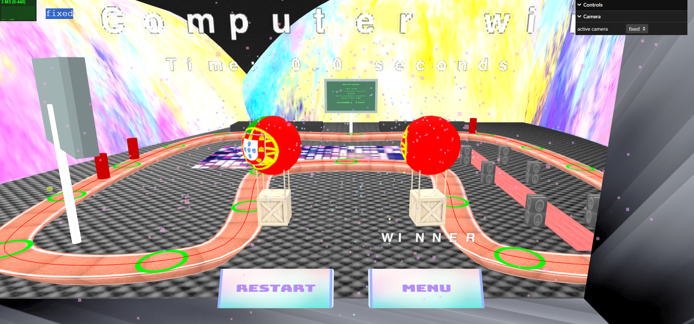
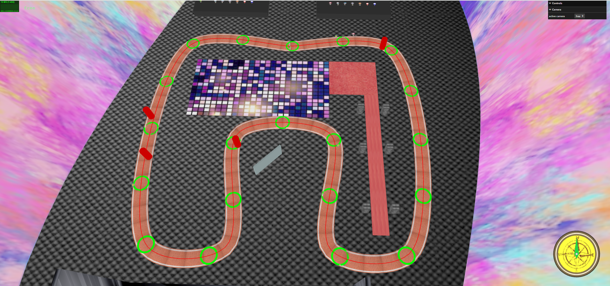

# SGI 2024/2025 - TP3

## Group: T08G03

| Name             | Number    | E-Mail             |
| ---------------- | --------- | ------------------ |
| Marcos Costa         | 202108869 | up202108869@fe.up.pt              |
| Rodrigo Moucho        | 202108855 | up202108855@fe.up.pt                |

----

## Project

This project is a balloon race game with the theme setting being a disco.

## Menus

### Start Menu

At the start of the game, the user is asked to input it's name and choose their and the computer's balloons. Additionally the starting position is also choosable.

### End Screen/Menu

At the end of the game an end screen will appear with:

- The winner's name
- The winner's time to conclude the race
- The two picked balloons (with rotating and pulsating animation for the winner)
- Fireworks
- Button to restart the race
- Button to go back to the Start Menu

## Game Elements

### Structure Track

The track was developed following the project's requisites. 

When the user's balloon goes out of the track a penalty is applied - the balloon stops and goes back to the ground in the middle of the track.

### Structure Power-ups

A power-up adds a voucher to the user's balloon

### Structure Obstacles

If the balloon has a voucher he loses it, else the balloon is stuck for a short time

Two routes were implemented, a faster one for the country balloons and a slower one for the colored balloons.

## Balloon

Two balloon models were implemented, country balloons and colored balloons. 

### Country Balloon

With a simpler model, the country balloon gives the user the choice to choose from a variety of nations - Portugal, Turkey, Brazil, USA, India and China.

### Colored Balloon

The colored (blue or red) balloon has a more complex model, closer resembling a hot air balloon.

- Both balloons have billboard LODs, in order to reduce computation time. These billboards are images of the balloon that always face the direction of the camera.

## Outdoor Display

Outdoor display

## Scenario

The scenario in our race is disco themed. The scenario relief is made with NURBS.

Additionally a stage was designed to simulate a DJ concert, alongside some music speakers, a disco ball, a red carpet and a dancefloor to improve immersion.

In the distance the balloon parking lots are also visible

## Implemented Techniques

### Picking

Object selection was implemented in a variety of sections:

- Clicking Menu Buttons
- Balloon Parking Lot navigation and choice picking
- Start Point picking

### Keyframe Animation

Keyframe Animation was implemented for the two computer balloon's implemented routes. 

### Collision Detection

Collision Detection was implemented for:

- Detection whether the balloon is off the track
- Balloon collision with other objects

### Spritesheets

Spritesheets were implemented and mostly used in Menus where text had to be displayed

### Shaders

Shaders were implemented to give a pulsating effect to objects such as obstacles and power-ups

### Particles System

The particles system is implemented in the end screen where fireworks are displayed

## Cameras

During the race the user has a third person and a first person camera that follows their balloon.

In Menus the camera is fixed.

At all times a "free" camera is available so the user can explore the scene if they desire.

